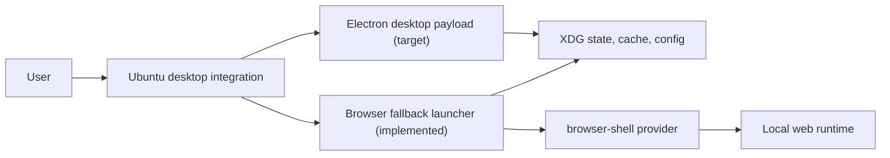

# codex-ubuntu

[](docs/roadmap.md)
[](docs/architecture.md)
[](packaging/deb/README.md)
[](docs/security.md)
[](LICENSE)

Unofficial Ubuntu-first Electron desktop project, with a browser fallback for recovery and constrained environments.

`codex-ubuntu` is trying to solve a very specific problem well: make the app feel genuinely at home on Ubuntu. The browser wrapper was useful as a safety exercise, but it is not the end state. The product target is now an Electron-first Ubuntu desktop experience, because that is the path that actually feels like a real app in daily use.

## Why this exists

Ubuntu users usually end up choosing between:

- browser-first one-off launch scripts
- brittle personal-machine wrappers
- heavy unofficial ports with a large maintenance surface

This repository now takes the harder but more honest path:

- Electron-first desktop direction
- browser launcher retained only as fallback and recovery
- explicit security rules around runtime ownership
- `.deb`-first packaging direction
- clear boundaries between desktop payload, compatibility patches, and fallback tooling

## What works today

The current repository is not just a design memo. It already ships:

- a repo-owned local Electron launcher wrapper for dogfooding
- a minimum Electron payload intake workflow
- a strict browser fallback launcher
- XDG config, cache, and state handling
- verified process ownership before stop or reuse
- runtime and browser discovery without hardcoded personal paths
- local install flow
- local Electron install flow
- `.deb` build path for the fallback utility
- smoke tests and CI
- Electron-first repo structure and migration docs

## Release status

| Capability | Status |
| --- | --- |
| Browser fallback launcher | Working preview |
| Repo-owned Electron dogfood wrapper | Working local-only |
| Minimum payload intake | Working preview |
| Self-contained Electron desktop package | Not yet |
| Updater | Not yet |
| Stable v1 release | Not yet |

## What it is not claiming

This repository is not yet:

- an official Linux desktop release
- a self-contained Electron desktop payload inside this repo
- a finished updater
- a promise to redistribute proprietary upstream app assets

The Electron direction is the main product path, but the exact asset and distribution model still has to stay explicit and careful.

## Current strategy

The project is now Electron-first.

That means:

1. the product target is an Ubuntu desktop app, not a dressed-up browser tab
2. the browser-shell path stays only as fallback and recovery mode
3. the provider contract still matters because both paths need safe runtime ownership rules
4. packaging remains `.deb`-first

### Runtime model

Implemented today:

- `browser-shell` fallback

Primary target:

- `desktop-payload` (Electron-first)

Optional later:

- `app-server`

See [providers/contract.md](providers/contract.md), [providers/browser-shell.md](providers/browser-shell.md), [docs/architecture.md](docs/architecture.md), and [docs/electron-first-plan.md](docs/electron-first-plan.md).

## Feature matrix

| Area | Current | Notes |
| --- | --- | --- |
| Repo-owned Electron launcher | Partial | Local dogfood wrapper around the current working desktop payload |
| Minimum payload intake | Yes | Imports `app.asar`, `start.sh`, version, build metadata, and icon into an ignored local vendor area |
| Browser fallback launcher | Yes | Strict launcher and recovery path |
| Electron-first repo structure | Yes | Docs and repo layout now point at the desktop path |
| Process-safe stop/reuse | Yes | Fallback launcher refuses to kill unverified runtimes |
| XDG state layout | Yes | Config, cache, and state are separated |
| Local install | Yes | `make install-local` installs the fallback utility |
| Local Electron install | Yes | `make install-electron-local` swaps the active desktop launcher to repo code with rollback preserved |
| Debian package build | Yes | Today this packages the fallback utility |
| CI | Yes | Syntax, smoke tests, packaging |
| Desktop-payload provider | Not yet | Main implementation target |
| App Server provider | Not yet | Optional future provider |
| Updater | Not yet | Deliberately deferred |

## Quick start

### Choose a path

| Path | Who it is for | Works from this repo alone? | Current reality |
| --- | --- | --- | --- |
| Browser fallback | People who want the current fully repo-owned path | Yes | Lowest-fidelity UX, but easiest to run from this repo today |
| Electron developer path | People who want the real desktop feel | No | Best UX, but currently requires an existing local desktop payload root |

### What you need locally

Browser fallback:

- `codex-app-linux` on `PATH`, or `CODEX_UBUNTU_APP_LINUX_CMD` set
- a supported browser on `PATH`, or `CODEX_UBUNTU_BROWSER` set
- `python3`, `curl`, and `xdg-utils`

Electron developer path:

- a local desktop payload root containing at least:
  - `start.sh`
  - `version`
  - `resources/app.asar`
  - `resources/codex-linux-build-info.json`
  - `.codex-linux/codex-desktop.png`
- whatever runtime expectations that payload already has

By default the repo-owned Electron wrapper looks for:

```text
$HOME/codex-desktop-linux/codex-app
```

Override it explicitly with:

```bash
CODEX_UBUNTU_ELECTRON_APP_ROOT=/path/to/codex-app
```

### Electron dogfood quick start

If you want the current `Codex Desktop` launch chain to come from this repo while still using the working Electron payload already on your machine:

```bash
make install-electron-local
```

That swaps the active local `Codex Desktop` wrapper to the repo-owned Electron launcher and preserves a `Codex Desktop (Legacy)` rollback entry.

### Minimum payload intake

If you want the repo to import the current local desktop payload slice for patch planning and provenance:

```bash
make import-electron-payload
```

That writes:

- `electron/vendor/current/`
- `electron/manifest/current.local.json`

### Electron developer install

For a fresh machine or another developer, the current Electron path is:

1. build or obtain a local desktop payload root
2. point the repo at it if it is not at `$HOME/codex-desktop-linux/codex-app`
3. import the minimum payload slice for provenance and patch planning
4. install the repo-owned Electron launcher

Example:

```bash
make import-electron-payload SOURCE_ROOT=/path/to/codex-app
make install-electron-local
```

### Fallback launcher quick start

If you want the current runnable implementation from this repo today, that is still the fallback launcher.

Strict behavior:

- invalid explicit runtime or browser overrides fail loudly
- non-loopback bind values require `CODEX_UBUNTU_ALLOW_NON_LOOPBACK=1`

Install it locally:

```bash
make install-local
```

That installs:

- `~/.local/bin/codex-ubuntu`
- `${XDG_DATA_HOME:-~/.local/share}/applications/codex-ubuntu.desktop`
- `${XDG_DATA_HOME:-~/.local/share}/icons/hicolor/scalable/apps/codex-ubuntu.svg`

Launch it:

```bash
codex-ubuntu
```

Or open `Codex Ubuntu (Unofficial)` from the Ubuntu app grid.

### What this repo does not ship yet

Today this repository does **not** provide:

- a vendored Electron payload in git
- a one-command self-contained Electron desktop install for strangers
- a direct upstream-DMG-to-local-payload build flow inside this repo

So the current Electron story is:

- this repo owns the launcher and intake workflow
- you provide or build the local desktop payload root
- the repo then launches and tracks that payload cleanly

## Architecture at a glance



More detail lives in [docs/architecture.md](docs/architecture.md).

## Security baseline

This project is opinionated about runtime safety even in preview form:

- never trust a stale PID file by itself
- verify runtime ownership before stop or reuse
- keep user state inside XDG directories
- avoid logging token-bearing URLs
- do not hardcode personal machine paths
- do not globally fake another operating system

Read [docs/security.md](docs/security.md) before extending runtime or desktop-launch logic.

## Repository layout

- `electron/` Electron-first intake plan and future desktop payload structure
- `launcher/` browser fallback launcher
- `desktop/` desktop entry templates and icon assets
- `packaging/deb/` Debian packaging templates
- `providers/` runtime/provider contract docs
- `tests/` smoke tests and fixtures
- `scripts/` install and build helpers
- `docs/` architecture, security, roadmap, FAQs, and ADRs

## Development

Run checks:

```bash
make test
```

Build a Debian package:

```bash
make build-deb
```

Install the repo-owned Electron dogfood launcher locally:

```bash
make install-electron-local
```

Read before contributing:

- [CONTRIBUTING.md](CONTRIBUTING.md)
- [SECURITY.md](SECURITY.md)
- [docs/faq.md](docs/faq.md)

## Design review questions

These are the intended pushback points now:

1. Which parts of the working Electron desktop should be brought into the repo first?
2. Where should the browser fallback stop being part of the default user story?
3. How thin can the Ubuntu-specific patch layer stay while preserving the app feel people actually want?
4. What must be true before the Electron path becomes the default shipped experience?
5. What asset and distribution model is acceptable before broader release?

## License

MIT for repository code and docs only.

This repository does not grant rights to proprietary upstream assets.
