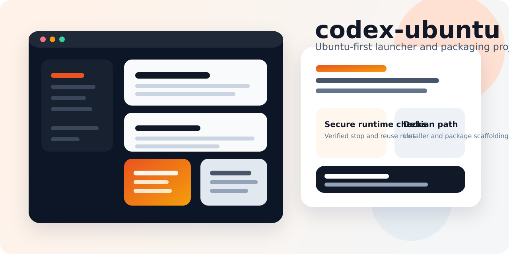
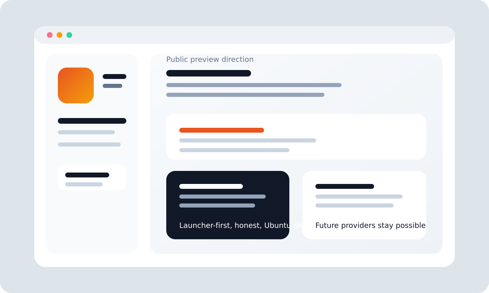
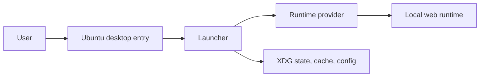

# codex-ubuntu



[](docs/roadmap.md)
[](docs/architecture.md)
[](packaging/deb/README.md)
[](docs/security.md)
[](LICENSE)

Unofficial Ubuntu-first launcher and packaging project for Codex.

`codex-ubuntu` is trying to solve a very specific problem well: make the app feel at home on Ubuntu without pretending Linux support is already finished upstream, and without baking in fragile local assumptions that break as soon as the machine changes.

## Why this exists

Ubuntu users currently end up choosing between:

- browser-first one-off launch scripts
- brittle personal-machine wrappers
- heavy unofficial ports with a large maintenance surface

This repository takes the narrower path:

- real Ubuntu launcher behavior
- explicit security rules around runtime ownership
- `.deb`-first packaging direction
- provider boundaries that leave room for future runtime strategies

## What works today

The current repository is not just a design memo. It ships a working launcher foundation with:

- dedicated app-window flow
- XDG config, cache, and state handling
- verified process ownership before stop or reuse
- runtime and browser discovery without hardcoded personal paths
- local install flow
- `.deb` build path
- smoke tests and CI



## What it is not claiming

This repository is not yet:

- an official Linux desktop release
- a full upstream desktop-payload repackager
- a finished updater
- a promise to redistribute proprietary upstream app assets

The local repackager path is still exploratory, not a committed milestone.

## Current strategy

The recommended v1 is intentionally launcher-first.

That means:

1. the Ubuntu launcher and desktop integration are real now
2. the browser-shell runtime path is implemented now
3. the provider contract is defined now
4. future runtime modes can be added without rewriting the project shape

### Runtime model

Implemented today:

- `browser-shell`

Planned but not implemented:

- `app-server`
- `desktop-payload`

See [providers/contract.md](providers/contract.md), [providers/browser-shell.md](providers/browser-shell.md), and [docs/architecture.md](docs/architecture.md).

## Feature matrix

| Area | Current | Notes |
| --- | --- | --- |
| Ubuntu launcher | Yes | Dedicated app-window flow and desktop identity |
| Process-safe stop/reuse | Yes | Refuses to kill unverified runtimes |
| XDG state layout | Yes | Config, cache, and state are separated |
| Local install | Yes | `make install-local` |
| Debian package build | Yes | `make build-deb` |
| CI | Yes | Syntax, smoke tests, packaging |
| App Server provider | Not yet | Tracked as a future provider |
| Desktop-payload repackager | Exploratory | Not tied to a committed release phase |
| Updater | Not yet | Deliberately deferred |

## Quick start

### 1. Install runtime prerequisites

The current launcher expects:

- `codex-app-linux` on `PATH`, or `CODEX_UBUNTU_APP_LINUX_CMD` set
- a supported browser on `PATH`, or `CODEX_UBUNTU_BROWSER` set
- `python3`, `curl`, and `xdg-utils`

### 2. Install locally

```bash
make install-local
```

That installs:

- `~/.local/bin/codex-ubuntu`
- `~/.local/share/applications/codex-ubuntu.desktop`
- `~/.local/share/icons/hicolor/scalable/apps/codex-ubuntu.svg`

### 3. Launch

```bash
codex-ubuntu
```

Or open `Codex Ubuntu (Unofficial)` from the Ubuntu app grid.

## Architecture at a glance



More detail lives in [docs/architecture.md](docs/architecture.md).

## Security baseline

This project is opinionated about launcher safety:

- never trust a stale PID file by itself
- verify runtime ownership before stop or reuse
- keep user state inside XDG directories
- avoid logging token-bearing URLs
- do not hardcode personal machine paths
- do not globally fake another operating system

Read [docs/security.md](docs/security.md) before extending runtime control logic.

## Repository layout

- `launcher/` launcher executable
- `desktop/` desktop entry template and icon assets
- `packaging/deb/` Debian packaging templates
- `providers/` runtime/provider contract docs
- `tests/` smoke tests and fixtures
- `scripts/` install and build helpers
- `docs/` architecture, security, roadmap, FAQs, and ADRs

## Development

Run checks:

```bash
make test
```

Build a Debian package:

```bash
make build-deb
```

Read before contributing:

- [CONTRIBUTING.md](CONTRIBUTING.md)
- [SECURITY.md](SECURITY.md)
- [docs/faq.md](docs/faq.md)

## Design review questions

These are the intended pushback points:

1. Is launcher-first still the right v1?
2. Is the provider contract concrete enough?
3. When should the exploratory repackager track graduate into an explicit milestone?
4. Is the current browser-shell runtime boundary too narrow or appropriately conservative?
5. What must be true before calling the project a public preview?

## License

MIT for repository code and docs only.

This repository does not grant rights to proprietary upstream assets.
